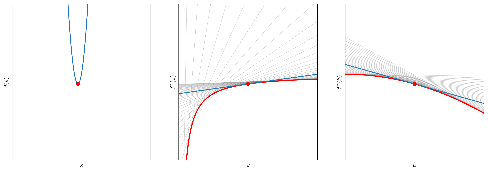

# The Envelope Theorem

The Envelope Theorem is an important mathematical tool in economics, but its abstract nature can make it challenging to completely understand. This repository provides interactive visualization tools to help with comprehension. For a deeper understanding of the mathematical process, I highly recommend consulting Simon and Blume's book.

The output will look like this, and you can play with the widgets to see how the indirect function changes:

